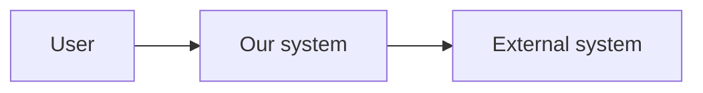

# Architecture / ops doc template (docs/architecture/**)

## File placement

- Prefer: `docs/architecture/<area>/` (example: `docs/architecture/aws/`).
- Filename: `kebab-case.md`.

## Template

Use this skeleton:

```markdown
# <Topic>

> Intent (Diátaxis): **Explanation** (why + tradeoffs) with a small **How-to** “Operational playbook” section.

## Executive summary
- 3–6 bullets: what exists today, what problem it solves, and what to do when it breaks.

## Goals / non-goals
- Goals:
- Non-goals:

## Constraints
- Regulatory/compliance constraints:
- Tech constraints (Rails/Postgres/etc):
- Operational constraints (maintenance windows, cost caps, etc):

## Context & scope
- Who/what uses this:
- External neighbors (systems/services):
- Interfaces (protocols, queues, DBs):

## Current state (source of truth)
- Config sources (files/paths):
- Environments (dev/staging/prod):
- Current topology / sizing:

## Architecture (C4-lite)

### System context (optional)


### Container view (recommended)
```mermaid
flowchart LR
  web[Web (Rails)] --> db[(PostgreSQL)]
  web --> redis[(Redis)]
  worker[Worker] --> db
```

## Solution strategy
- Big decisions (and why):
- Alternatives considered:
- Trade-offs accepted:

## Building blocks (static view)
- Major components/modules and responsibilities:
- Key directories/files (map to code):

## Runtime scenarios (dynamic view)
- Scenario A: <request/flow> (happy path)
- Scenario B: <failure path> (timeouts/retries/dead letters/etc)

## Deployment view
- Environments and deploy topology:
- Scaling knobs:
- Migration/rollout strategy:

## Operational playbook
- Deploy steps:
- Maintenance windows:
- Monitoring & alerts:
- Runbooks / common incidents:
- Rollback / backout strategy:

## Performance / scaling notes
- Bottlenecks:
- Connection pool math / limits:
- Caching strategy:

## Security considerations
- Secrets handling:
- Network boundaries:
- Audit/logging:

## Risks & technical debt
- Known risks:
- Known debt:
- “Next likely failure”:

## Architectural decisions
- Link to ADR(s) or record decisions inline:
  - Decision:
  - Status (proposed/accepted/superseded):
  - Consequences:

## Glossary (optional)
- Term:
- Term:
```

## Index updates

Add the new link to the nearest `README.md` (e.g. `docs/architecture/aws/README.md`).

